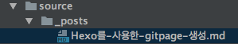

### hexo 설치 및 블로그 초기 생성 환경 구축 
```command
npm i -g hexo-cli
hexo init ${blog name}
cd ${blog name}
npm i
hexo s

```

### github repository 생성
- repository를 "${github 계정이름}.github.io"로 생성하면 자동으로 master branch를 entory gitpage로 설정됨
- 임의의 repository 이름으로 생성하는 경우, "${github 계정이름}.github.io/${임의로 생성한 repository 이름}" 형태로 gitpages 생성됨
- 참고 : http://blog.lattecom.xyz/2016/06/28/hexo-blog-github-pages/

### hexo n ${post 이름} 명령어를 통한 POST 생성
```command
hexo n ${post 이름}
```
```hexo n "Hexo를 사용한 gitpages 생성"``` 명령을 수행하면 아래와 같이, source > _posts 경로에 *.md 파일이 생성됨







### 상대 경로 이미지 등록
1. 이미지 설정을 위해 경로는 _config.yml파일 ```post_asset_folder: true```과 같이 설정
2. 상대 경로 문제로 인해 기존 markdown문법 아닌  ```{ % asset_img "bd697bd2.png" "source > _posts 경로" % }```으로 이미지 설정
참고 : https://hexo.io/ko/docs/asset-folders.html#전역-Asset-폴더


- 참고 : https://hexo.io/ko/index.html